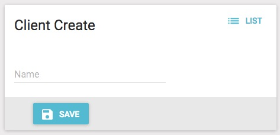

# Example - Register your client application

In this step, you will register your client application and generate a key that will be used later in the client configuration.

## Register the Client
On the left menu of the Function Router Console, select "Clients", and then press "Create".  The resulting screen should look like this:

There, enter the name of your client and press "Save".

From the Client List screen, copy the ID field to be used later:

Next, click on the pencil on the far right of your registered client to go to the Edit screen:

There, copy the 'AccessToken' field to be used later.