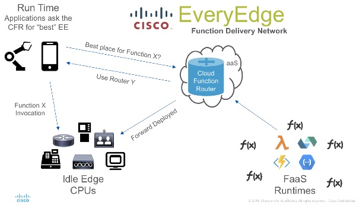

# EveryEdge Function Router Concepts
Edge devices like routers, kiosks, ATMs, cell towers, and other examples that are essentially fancy Linux boxes have not only proliferated throughout places we walk past every day but have also become more powerful in terms of CPU and memory.  Simultaneously, serverless application architectures have shrunk what we have all come to think of as a programmatic execution unit to a smaller piece of code than was previously possible.  At the intersection of edge device growth and code size reduction is the space for the EveryEdge Function Router.

The EveryEdge Function Router is a management plane that tracks Function-as-a-Service (FaaS) runtimes, edge devices and environments capable of running those FaaS runtimes, functions that can execute on those FaaS runtimes, and provide a lookup method that client applications can use to determine what is the best location to run a specific function at a specific time.  In concept, it is very similar to a Content Delivery Network, hence why it is described as a Function Delivery Network.

## Use Cases
Any scenario that places a large number of client applications in close proximity to one another, often times creating bandwidth bottlenecks to the public Internet, is a good use case for instead taking advantage of spare CPUs in edge devices.  That includes, but is not limited to:

* **Retail** - With groups of customers in a known physical location and known local inventory, caching data and functions that can operate on that data on edge devices can deliver sub-second response times for mobile applications thereby improving customer satisfaction and engagement.
* **Entertainment** - Think about crowds at concerts or sporting events all using the same application to access the same data whose API sits thousands of miles away at a data center and the ISP bottleneck that creates and the usefulness of the EveryEdge Function Router becomes clear.
* **Manufacturing** - Complex machinery constantly fires IoT data to back ends and in situations of duress like a robot arm reporting a heat threshold being exceeded, response time of back end can be critical and mitigated by executing such logic on a device closer to the manufacturing floor.

## Terminology
Given the newness of the Function Delivery Network concept, it is important to be clear on terminology used throughout this example application:

* **Client Application** - A mobile app, IoT client, or other front end that needs some compute decision made on some data on some back end.
* **Function** - The executable unit that performs the back end decision and often has a snapshot of data packaged with it.
* **Service** - The EveryEdge Function Router uses the [Serverless Framework](http://serverless.com) behind the scenes to deploy functions and within that paradigm, functions can be bundled together in groups called services.
* **FaaS Runtime** - The Function-as-a-Service environment that the functions will run on.  Examples include AWS Lambda and IBM OpenWhisk
* **Execution Endpoint (EE)** - The venue on top of which the FaaS runtime executes.  Examples include an AWS data center that supports Lambda or an edge device that has OpenWhisk installed on it.
* **Location** - A set of latitude and longitude coordinates that represents a physical location
* **Project** - An envelope concept that separates the scope of registrations of the above from one another.  Every user belongs to at least one Project and users can invite other users to their Project.

## Mechanics
At configuration time, an administrator uses the EveryEdge Function Router Console ([console.functionrouter.com](http://console.functionrouter.com)) to register Functions, EEs, and Client Applications.

At runtime, a Client Application that needs certain functionality asks the Function Router where what EE it should contact to run a particular function.  The Function Router will examine the known list of EEs for the Project the Client Application belongs to in order to find the best one.  Upon making this selection, the Function Router will then look at its inventory of Functions to see if that EE already has the function requested.  If it does not, the Function Router will deploy the Function to that EE.  The Function Router will then return the URL to the Client Application to use, which it then does to perform its logic.

