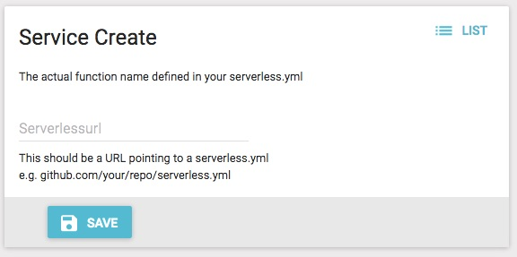

# Example - Register the OpenWhisk function
In this step, you will register the the function that will be automatically deployed onto your Execution Endpoint when the first lookup occurs.

## Register the Function
On the left menu of the Function Router Console, select "Services", and then press "Create".  The resulting screen should look like this:

Note that Services might contain multiple Functions, hence the terminology.

In the 'Serverlessurl' field, enter `https://github.com/functionrouter/example/backend/openwhisk/serverless.yml` and press "Save".  This is the URL to the `serverless.yml` file provided for this example.  When you press "Save", the function will be prepped for deployment on any Execution Endpoint running OpenWhisk and stored in Function Router.

Be sure to note the generated Service ID, as that will be used to configure the client later.

