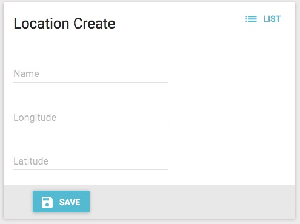

# Example - Register your OpenWhisk Execution Endpoint and Location
In this step, you will first register the location of your Execution Endpoint created in the previous step and register its Endpoint with the Function Router console.

## Register your OpenWhisk Location
Login to the Function Router Console and on the left menu, select "Location", and then press "Create".  The resulting screen should look like this:

There, enter the name, longitude, and latitude of the location of your Execution Endpoint and press "Save".  Note that the latitude and longitude do not have to be as precise for this example application as they would for a production use case, so best guess is fine for now.

## Register your OpenWhisk Execution Endpoint
With the location of the Execution Endpoint entered, next, on the left menu, select "Execution Endpoints", and then press "Create".   The resulting screen should look like this:

There, enter the name you would like to use for the Execution Endpoint and select dropdowns for the location you just entered and the OpenWhisk runtime as appropriate.

In the last three text boxes, enter the following:

* **AWS Access Key / OpenWhis API Host** - Enter the public IP address of your Execution Endpoint.
* **AWS Secret / OpenWhisk username:pass** - Enter the OpenWhisk auth key noted during your Execution Endpoint deployment.  By default, this value is `23bc46b1-71f6-4ed5-8c54-816aa4f8c502:123zO3xZCLrMN6v2BKK1dXYFpXlPkccOFqm12CdAsMgRU4VrNZ9lyGVCGuMDGIwP`.
* **OpenWhisk Namespace** - Enter the OpenWhisk namespace noted during your Execution Endpoint deployment.  By default, this value is `guest`.

When done, press "Save".